Demo Brief: Event-Driven VM Provisioning with ServiceNow and Ansible Automation Platform 2.5
=========
This demo showcases how ServiceNow and Red Hat Ansible Automation Platform (AAP) 2.5, using Event-Driven Ansible (EDA), can be integrated to automate virtual machine (VM) provisioning through a Service Catalog request.

Use Case Overview
A user initiates a VM request via the ServiceNow Service Catalog. This request follows an approval and fulfillment process automated through ServiceNow and EDA:

1. The user submits a VM request from the Service Catalog.

1. A ServiceNow Flow Designer workflow simulates a manager approval step.

1. Once approved, the same flow continues to create a catalog task.

1. A ServiceNow business rule, triggered by the creation of this task, sends a payload containing the VM request details to Ansible EDA.

1. Ansible Automation Platform 2.5, using EDA Event Streams, receives this event and executes the appropriate automation workflow to provision the VM.

This demo illustrates how event-driven automation can streamline IT operations by connecting user service requests in ServiceNow with automated VM provisioning workflows in Ansible Automation Platform.

General info on Event Streams (simplified event routing)
------------
In AAP 2.5 we have Event Streams. Event streams simplify routing by connecting your sources directly to your rulebooks. They let webhook-based sources trigger one or many rulebook activations without needing separate endpoint configurations. This approach supports horizontal scaling, so any webhook-capable source—like SCMs, ITSMs, or observability tools—can automatically trigger actions when conditions are met.
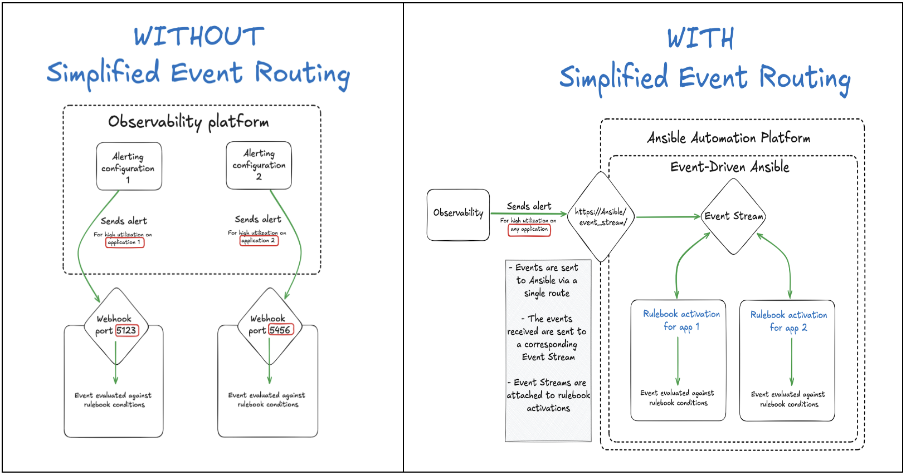

Demo Setup Instructions
=========

Assumptions
------------
- AAP 2.5 is deployed and default decision environment available
- Service Now Developer instance has been created

Initial Actions on AAP
------------
We have to create two credentials for this demo. One is a token for the event stream to accept incoming messages, the other is the AAP credential to run a job template.
Log into AAP. Navigate to Automation Decisions > Infrastructure > Credentials. Click Create credential. Give the token a name (SNOW_token), choose an organisation, select 'Token Event Stream'. In the Type Details section, generate a random token and paste it into the Token field (Keep a note of this token somewhere). Leave HTTP Header Key as 'Authorization' (default). Then click 'Create credential'.

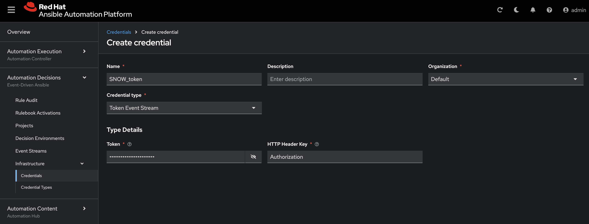

 
Now for the second credential, the instructions are the same but adjust the details to suit the screenshot. Remember to append '/api/controller/' to your AAP URL. Finally click 'Create credential'

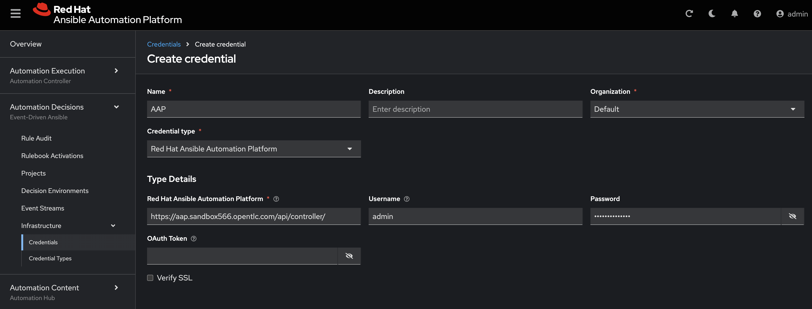

 
Now that we have both tokens created, we can create the Automation Decisions project. Go to Automation Decisions > Projects, click 'Create project'. Enter a name for the project and the Source control URL (This github project). Then click 'Create project'.

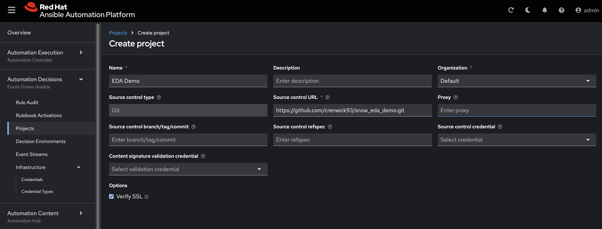

 

Next we need the Event Stream. Go to Automation Decisions > Event Streams. Click 'Create event stream'. Name the event stream, select 'Token Event Stream' as Event Stream Type, then select 'SNOW Token' as the credential (which we previously created). 'Forward events to rulebooks activation' should be enabled. Then click 'Create event stream'. Copy the URL that is displayed in the newly created event stream. We will need it in the next tasks.
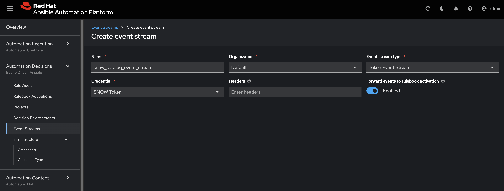

 

Lets test this
------------

Log onto your developer instance of Service Now. Navigate to 'All' > 'System Definition' > 'Scripts - Background'. This will allow you to run a freeform script to ensure the EDA has been setup correctly. Copy and paste the webhook_test_script.js script found in the snow_scripts directory of this repo. Replace 'example-url' with the URL that you copied in the above task. Replace the 'example-token' with the token found in credential you previously created. I have done so, in the example below. Click run and you should see a HTTP responce of 200 returned. 
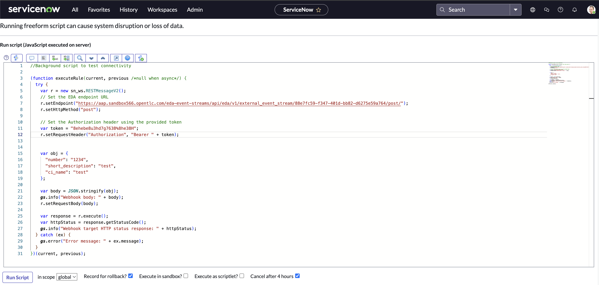

As well as 1 event recieved in your newly created event stream in AAP.
 

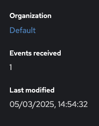
 

**Note: If you get any SSLPeerUnverifiedException errors at this point, look at the Troubleshooting section at the end of the tutorial**

ServiceNow Flow configurations
------------
We now need to take a look at the flow of events, starting from servicenow and how we configure that.
 
First off we will create a new fulfillment group. Inside of ServiceNow go to all > Service catalog > Catalog administration > Fulfillment groups. From here create a new Fulfillment group called Event Driven Ansible. In future steps, we will create a buiness rule to ensure anything in this fulfillment group is processed by EDA.

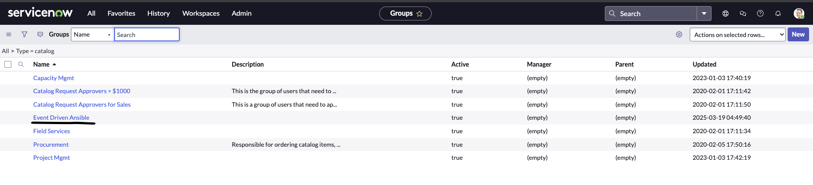
 
 
Now lets create a Flow that will utilise this group.
 
 
Go to All > Process automation > Flow designer. Once inside the flow dewigner, find the "Service Catalog item request" Flow and click into it.
 
Then look for the three dots on the top right hand side and click "copy flow". This will ask you to name your new workflow. I've named it the following.
Click copy, now we have your new workflow.

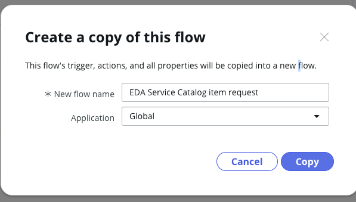
 

 
Taking a closer look at this workflow, we can see we have a few events happening.
 
Go ahead and delete all of the actions, leaving only the trigger as shown below:
 

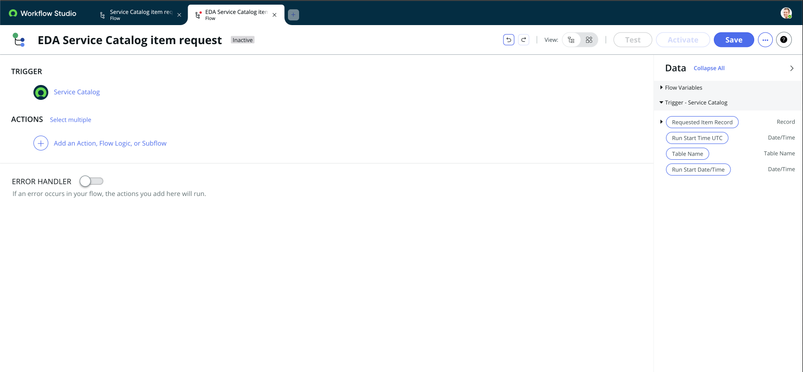
 
 
Add a new action under ServiceNow Core > Ask for Approval.

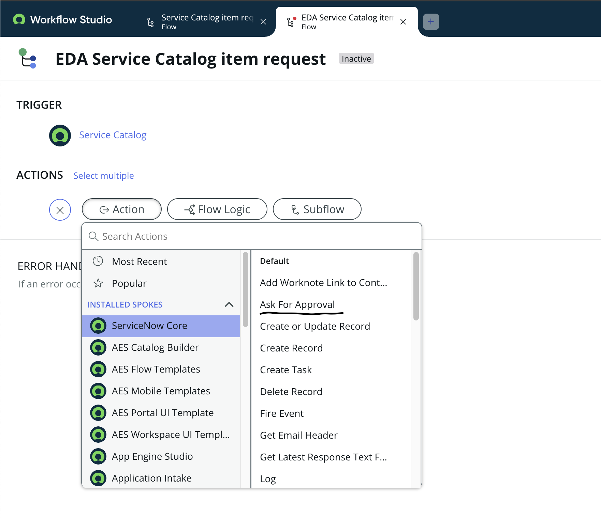
 

Drag the 'Requested Item Record' on the right to the Record box. Table, Approval Field and Journal Field should auto populate.
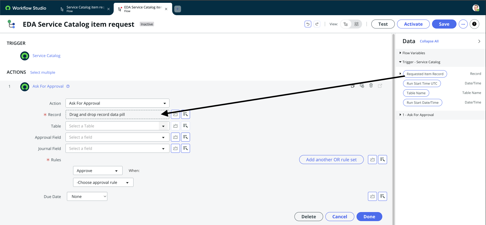
 

Under rules, we'll keep this simple and ask the System Administrator to approve. Select Approve **When** Anyone Approves. Then click the Add User button circled below to add the System Administrator. 

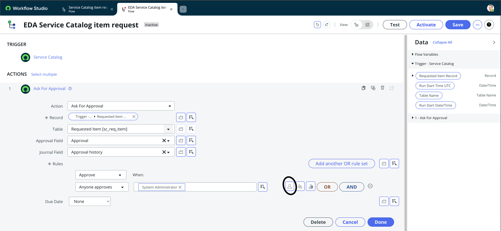
 

Create a new action ServiceNow Core > Create Catalog Task. 

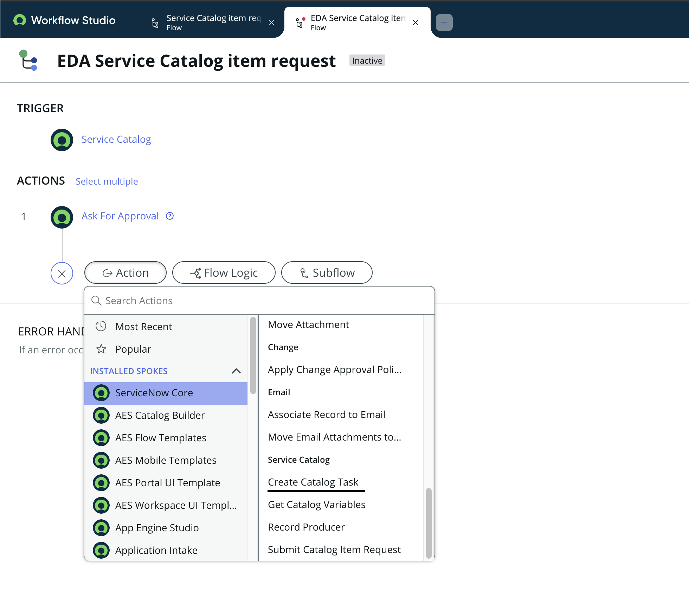
 
Drag the 'Requested Item Record' from the left menu, into the Requested item box, (as shown in previous example). Give a short description of the task, then add an 'Assignment Group' field and set it to 'Event Driven Ansible' (The fulfillment group you created earlier).

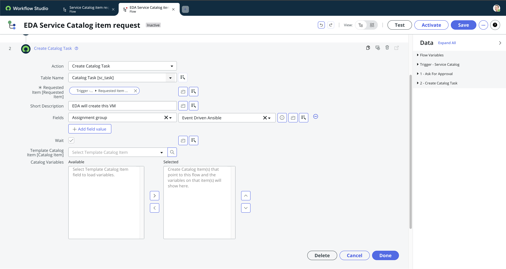

 

Optionally, you can add stages add point, as shown below. Once finished, click save and then activate to make the Flow available.

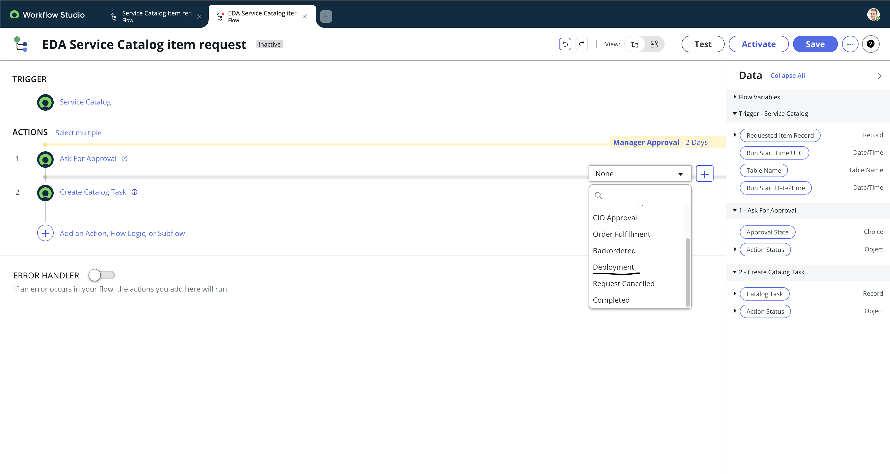
 
 
**Note: This flow is for demo purposes only, I have missed obvious things such as manager rejection to end the flow and more. You can include these things if you want, but i'm keeping things simple.**

ServiceNow Catalog Item
------------
In the SNOW developer instance, we have an existing catalog item called "VM Provisioning". Lets find that item and amend it, to use our new workflow.
 
 
Go to, All > Service Catalog > Catalog Definitions > Maintain Items. Then search for "VM Provisioning". Click into the "VM Provisioning" item. You will see a tab called "Process Engine". Click on that, then adjust the flow to our newly created "EDA Service Catalog item request" flow, as shown below. Then click update.

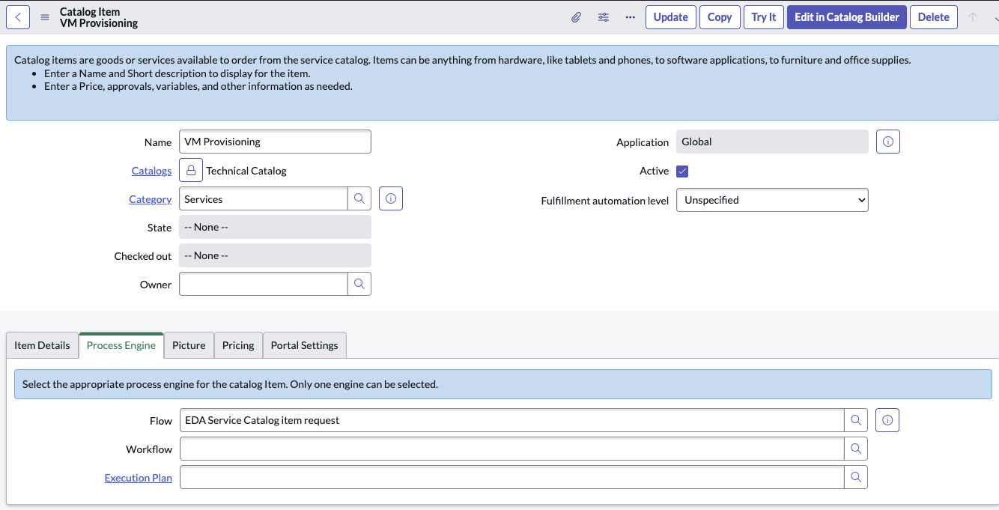

ServiceNow Business rule
------------
We now need to setup a new business rule, that states that any new item created, with Assignment Group = Event Driven Ansible, should be processed by Event Driven Ansible. To do this, we need to create a business rule.
 
 

Setup a business rule in ServiceNow. Navigate to **Activity subscriptions** -> **Administration** -> **Business rules** or just search for **Business rules**. Click "New" to create a new business rule. Fill in the first form:

* Enter a name for the business rule
* Table should be set to **sc_task**
* Tick the **Advanced** checkbox

In the **When to Run** section:

* Set action on insert.
* when to run should be "after".
* Add a condition. For example assignment group is equal to "Event Driven Ansible".
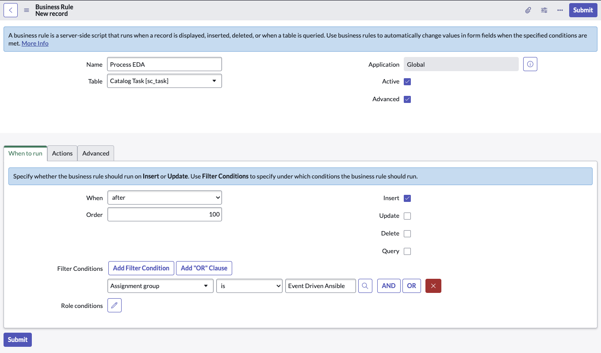

 
 

On the **advanced** tab, copy the script from webhook_catalog_item.js found under the snow_scripts directory in this repo. Paste the script in the box provided and click save.
 
This will send a json payload to EDA which contains the CI name, incident number and incident short description.

**NOTE** make sure you substitute your EDA Event Stream URL and token shown in the screenshot below.
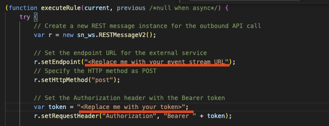
 
 
The rest of the script is used  for grabbing the important infomration from the request and composing the json package ready to send to EDA. Adjust this if you like.
 

Now back to AAP to finish off this setup
------------
So at this point we have a Service Now catlog item configured to send a payload to EDA. But at this point EDA has no idea what to do with that payload. So now we'll create a Rulebook Activation to process that payload, and in turn process the request.
 
 
In AAP, go to Automation Decisions > Rulebook Activations. Click 'Create rulebook activation'. Give it a suitable name and Organisation. From the project drop down, select 'EDA Demo' - the project we created previously. Under the Rulebook drop down, select snow_rulebook_debug.yml. You can see details of that rulebook in this repo under rulebooks (as this is the repo that project is reading from). We are choosing this rulebook as an initial rulebook because it is very simple and will simply outpu the payload so that we know the conneectivity between SNOW and EDA is working, before we go to more advanced things.
 
 
Under Event streams, click on the litle cog, it will take you to the below screen. Select the event stream that you created earlier, then click save.

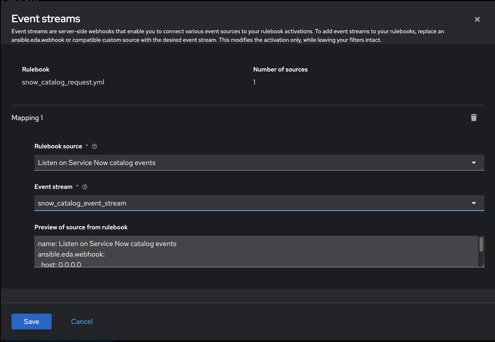
 
 
Then complete the rest of the rule activation form, selecting the AAP credential so that EDA can run job templates in controller. Also selecting your default decision environment so that we can run the rulebook. Your Rule activation should now look like the following. Click 'Create rulebook activation' and the rulebook will start up.

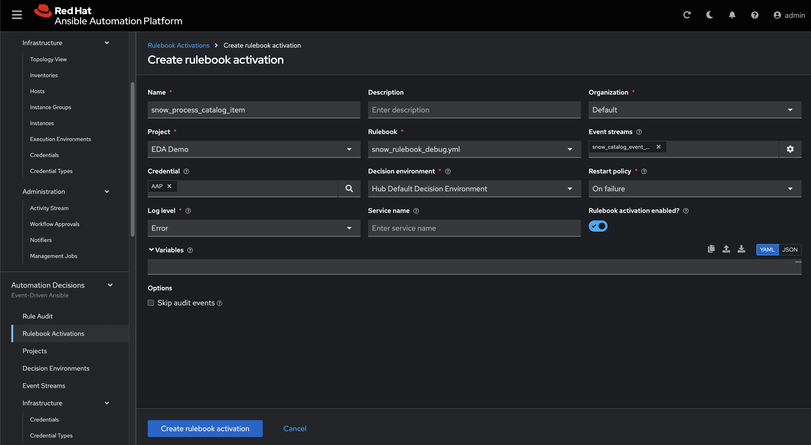
 
 
After a short while, you will see the rulebook running.

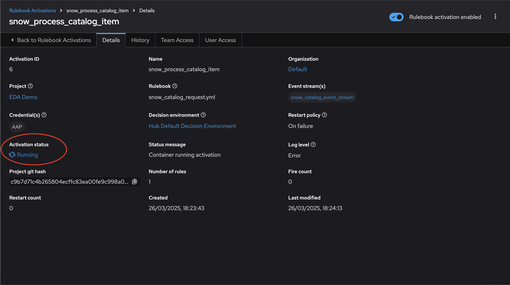
 
 
Under Automation Decisions > Rulebook Activations you can see a high level view of your Rulebooks. This is an easy way to keep an eye on your Rulebooks and which ones are firing.

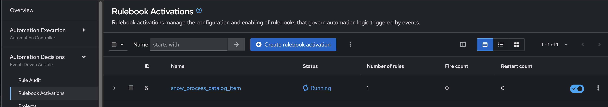

Joining the dots - let's give it a go
------------
At this point we configured everything on the Service Now side and everything on the EDA side, from a configuration perspecive at least - we will look at rulebooks more closely once we know it's all fully connected and working.
 
 
Go to All > Catalogs. Then click into Technical Catalog. From that window, you will see 'VM Provisioning' under Services. Click on that.
 
 
Complete the form with example vm details, then click order.

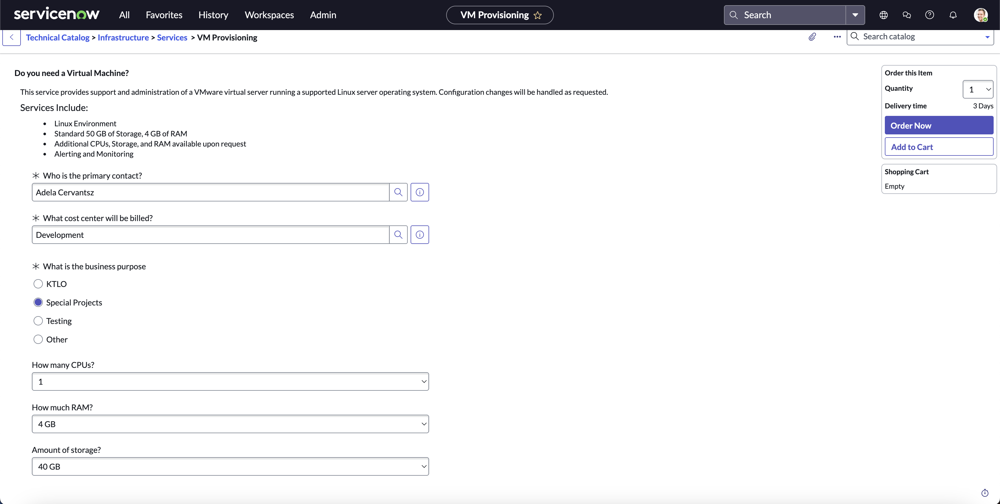
 
Now we need to approve that request. Go to All > Self Service > My Approvals. You will see a new approval requested.

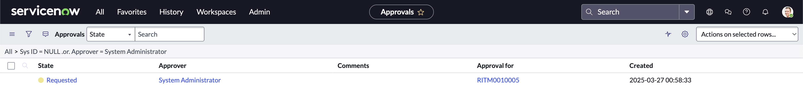
 
 
Click into the approval request. You will see the following screen. **Do not click approve just yet.**

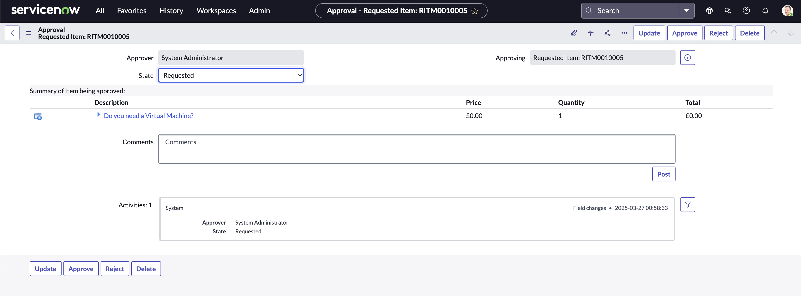
 
 
Go back onto AAP, go to Automation Decisions > Rulebook Activations. Then click on your newly created rulebook activation. Then click on the history tab. You should see the rulebook running here, click into it, this will bring up the rulebook logs.

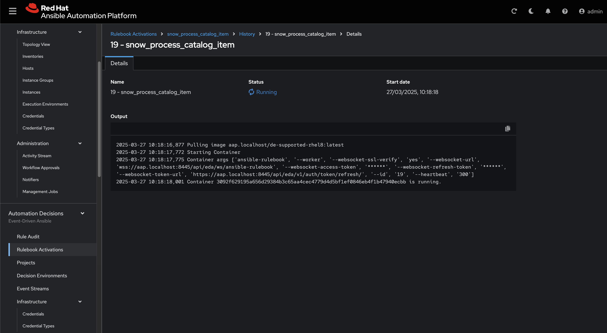
 
 
Now go back to the approval screen in Service Now and click approve. After a little while, you should see the payload recieved in the logs.

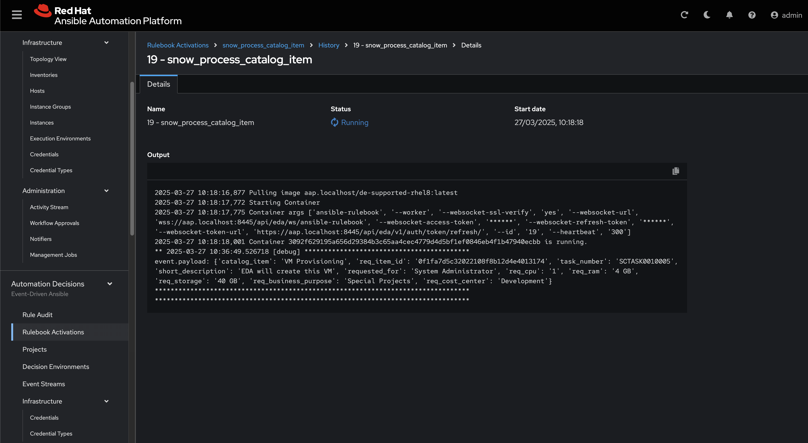
 
 
Now we know that we are up and working. It's time to do some actual automation.

Troubleshooting
------------
**Certs - SSLPeerUnverifiedException error**
 
If you're getting this issue whenrunning the script on Service Now targeting EDA. You may need to add the root CA cert to SNOW. Make sure to use the cert corresponding to the load balancer if you have a HA installation.
 
Instructions: Go to System Definition > Certificates in your SNOW instance, you can add your root CA cert there.
 
 
**Any other issue**

