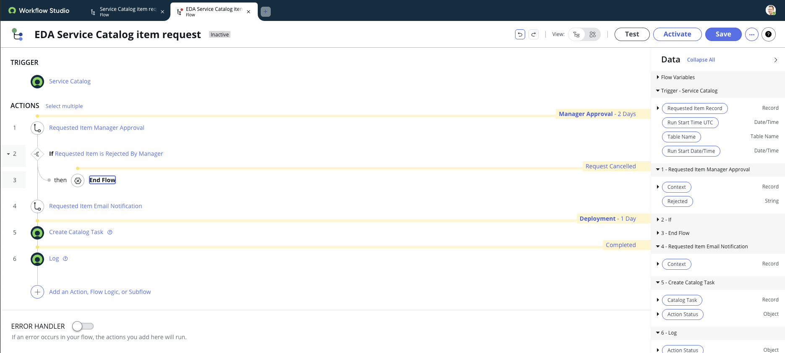
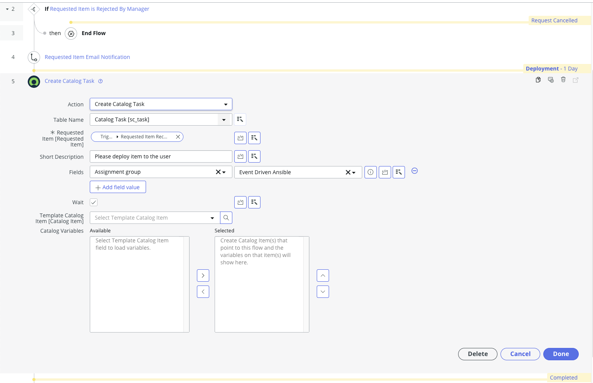
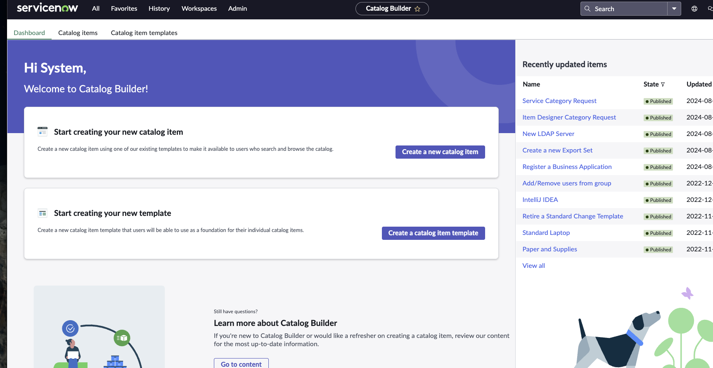
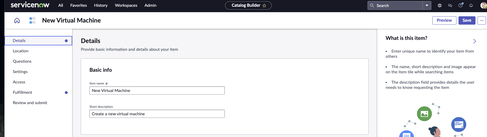
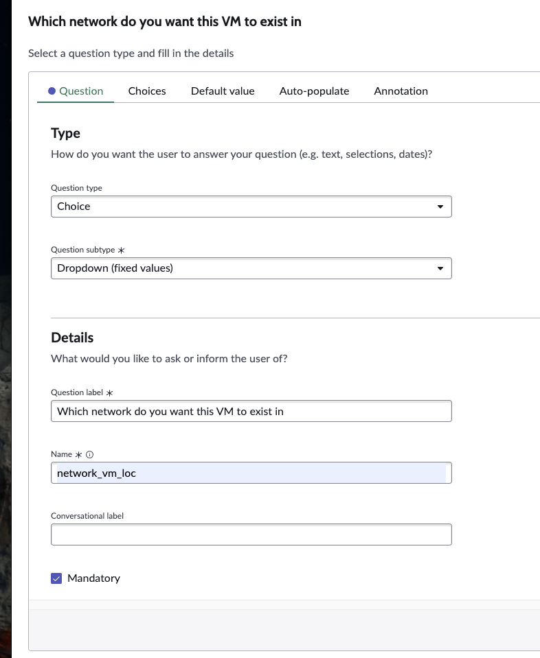

ServiceNow incident demo
=========

For this demo, we use ServiceNow business rules to send events to AAP 2.5 (EDA) each time an incident is opened. ServiceNow is the event source which will send a payload to EDA. EDA will be using an Event stream (only available on AAP 2.5>) to listen to listen for the payload. 

General info on Event Streams (simplified event routing)
------------
In AAP 2.5 we have Event Streams. Event streams simplify routing by connecting your sources directly to your rulebooks. They let webhook-based sources trigger one or many rulebook activations without needing separate endpoint configurations. This approach supports horizontal scaling, so any webhook-capable source—like SCMs, ITSMs, or observability tools—can automatically trigger actions when conditions are met.


Demo Setup Instructions
=========

Assumptions
------------
- AAP 2.5 is deployed and default decision environment available
- Service Now Developer instance has been created

Actions on AAP
------------
We have to create two credentials for this demo. One is a token for the event stream to accept incoming messages, the other is the AAP credential to run a job template.
Log into AAP. Navigate to Automation Decisions > Infrastructure > Credentials. Click Create credential. Give the token a name (SNOW_token), choose an organisation, select 'Token Event Stream'. In the Type Details section, generate a random token and paste it into the Token field (Keep a note of this token somewhere). Leave HTTP Header Key as 'Authorization' (default). Then click 'Create credential'.


<br>
Now for the second credential, the instructions are the same but adjust the details to suit the screenshot. Remember to append '/api/controller/' to your AAP URL. Finally click 'Create credential'


<br>
Now that we have both tokens created, we can create the Automation Decisions project. Go to Automation Decisions > Projects, click 'Create project'. Enter a name for the project and the Source control URL (This github project). Then click 'Create project'.


<br>

Next we need the Event Stream. Go to Automation Decisions > Event Streams. Click 'Create event stream'. Name the event stream, select 'Token Event Stream' as Event Stream Type, then select 'SNOW Token' as the credential (which we previously created). 'Forward events to rulebooks activation' should be enabled. Then click 'Create event stream'. Copy the URL that is displayed in the newly created event stream. We will need it in the next tasks.


<br>

Lets test this
------------

Log onto your developer instance of Service Now. Navigate to 'All' > 'System Definition' > 'Scripts - Background'. This will allow you to run a freeform script to ensure the EDA has been setup correctly. Copy and paste the webhook_test_script.js script found in the snow_scripts directory of this repo. Replace 'example-url' with the URL that you copied in the above task. Replace the 'example-token' with the token found in credential you previously created. I have done so, in the example below. Click run and you should see a HTTP responce of 200 returned. 


As well as 1 event recieved in your newly created event stream in AAP.
<br>


<br>

ServiceNow Flow configurations
------------
We now need to take a look at the flow of events, starting from servicenow and how we configure that.
<br>
First off we will create a new fulfillment group. Inside of ServiceNow go to all > Service catalog > Catalog administration > Fulfillment groups. From here create a new Fulfillment group called Event Driven Ansible. In future steps, we will create a buiness rule to ensure anything in this fulfillment group is processed by EDA.


<br>
<br>
Now lets create a Flow that will utilise this group.
<br>
<br>
Go to All > Process automation > Flow designer. Once inside the flow dewigner, find the "Service Catalog item request" Flow and click into it.
<br>
Then look for the three dots on the top right hand side and click "copy flow". This will ask you to name your new workflow. I've named it the following.
Click copy, now we have your new workflow.

<br>

<br>
Taking a closer look at this workflow, we can see we have a few events happening.
<br>
Go ahead and delete actions "If Requested Item is a Backorder", "Requested Item Dept Head Approval" and the first "Create Catalog Task". These are not required and will allow us to see a little clearer what is happening. This should leave 6 steps, as shown below:
<br>


<br>
<br>
Click into "Create Catalog Task" and change Assignment Group from Field Services to Event Driven Ansible. Then click done. Then at the top of that page, click save. Then make sure to click activate, to make this avaialble on a global scope.


<br>

ServiceNow Catalog Item
------------
In the SNOW developer instance, we have an existing catalog item called "VM Provisioning". Lets find that item and amend it, to use our new workflow.
<br>
<br>
Go to, All > Service Catalog > Catalog Definitions > Maintain Items. Then search for "VM Provisioning". Click into the "VM Provisioning" item. You will see a tab called "Process Engine". Click on that, then adjust the flow to our newly created "EDA Service Catalog item request" flow, as shown below. Then click update.


ServiceNow Business rule
------------
We now need to setup a new business rule, that states that any new item created, with Assignment Group = Event Driven Ansible, should be processed by Event Driven Ansible. To do this, we need to create a business rule.
<br>
<br>

Setup a business rule in ServiceNow. Navigate to **Activity subscriptions** -> **Administration** -> **Business rules** or just search for **Business rules**. Click "New" to create a new business rule. Fill in the first form:

* Enter a name for the business rule
* Table should be set to **sc_task**
* Tick the **Advanced** checkbox

In the **When to Run** section:

* Set action on insert.
* when to run should be "after".
* Add a condition. For example assignment group is equal to "Event Driven Ansible".


<br>
<br>

On the **advanced** tab, copy the script from webhook_catalog_item.js found under the snow_scripts directory in this repo. Paste the script in the box provided and click save. 
<br>
This will send a json payload to EDA which contains the CI name, incident number and incident short description.

**NOTE** make sure you substitute your EDA instance and port number in the example below - this line **r.setEndpoint("http://eda.example.com:5000/endpoint");**

```bash
(function executeRule(current, previous /*null when async*/ ) {
 try {
 var r = new sn_ws.RESTMessageV2();
 // Enter EDA URL and port number here. In this one we have eda.example.com port 5000.
 r.setEndpoint("http://eda.example.com:5000/endpoint");
 r.setHttpMethod("post");

 // some stuff to get ci name instead of id

 var ci = new GlideRecord('cmdb_ci');
 ci.get('sys_id', current.getValue("cmdb_ci"));
 var ci_name = ci.getValue('name');

 var number = current.getValue("number");	
 var short_description = current.getValue("short_description");
 var cmdb_ci = current.getValue("cmdb_ci");	

 var obj = {
 "number": number,
 "short_description": short_description,
 "ci_name": ci_name,

 };
		
 var body = JSON.stringify(obj);
 gs.info("Webhook body: " + body);
 r.setRequestBody(body);

 var response = r.execute();
 var httpStatus = response.getStatusCode();
 } catch (ex) {
 var message = ex.message;
		gs.error("Error message: " + message);
 }

 gs.info("Webhook target HTTP status response: " + httpStatus);

})(current, previous);
```

This was adapted from https://www.transposit.com/devops-blog/itsm/creating-webhooks-in-servicenow/


Quick and easy test
------------

SSH to your EDA controller and install netcat:

```bash
sudo dnf install nc -y
```

Start listening on port 5000

```bash
nc -l 5000
```

Create a ServiceNow Incident using the playbook in this repo or manually. Make sure you actually set a valid CI or it might not work.


You'll see this payload come through to your EDA controller. If this works you can create a rulebook. Examples in this repo.

```bash
$ nc -l 5000
^[[BPOST /endpoint HTTP/1.1
Content-Length: 73
X-SNC-INTEGRATION-SOURCE: b3331a101b02b5941024eb9b2d4bcbfb
User-Agent: ServiceNow/1.0
Host: eda.example.com:5000

{"number":"INC0010004","short_description":"testing","ci_name":"lnux100"}
```


Pat's own notes because he forgets - AAP setup
------------

Edit vault file with ServiceNow and controller details:

```bash
ansible-vault edit group_vars/all/vault.yml 
```

Run the playbook to configure controller:

```bash
ansible-navigator run configure_controller.yml --ask-vault-pass
```

Extra manual steps I haven't automated yet:

* Create a token for eda application and paste into EDA controller
* Create rulebook and project in EDA controller
* Ensure ServiceNow host has relevant CI in the Linux DB
* Add the same CI to the Demo inventory in controller
* Paste the aap users private key into the credential in controller

Troubleshooting
------------
Certs

Ensure the root CA cert exists in System Definition > Certificates in your SNOW instance. Otherwise you will get certificate trust issues when trying to communicate with EDA. 

Other things you might want tio know: Creating ServiceNow Catalog Item
------------
We need to create a new servicenow catalog item to simulate our use case of creating a VM.

Navigate to Srvice Catalog > Catalog Builder. Then click create a new catalog item.

<br>
<br>
Select the template "Standard items in Service Catalog", then click "Use this template".
<br>
Choose a name and short description for your new catatlog item (appropriate to vm creation)

<br>
Click through the catalog item creation process, until you get to questions. We'll keep this very simple for demo purposes.
The only question we will create is a drop down menu for selecting where to create the VM.
Write your question label, then under "name" put "network_vm_loc". This is a variable name we can use later.
Click into choices and add choices: management, services, dmz. Make management the default answer and click "Insert question".


<br>

Leave every other option defaulted and click save. This will create the new catalog item.